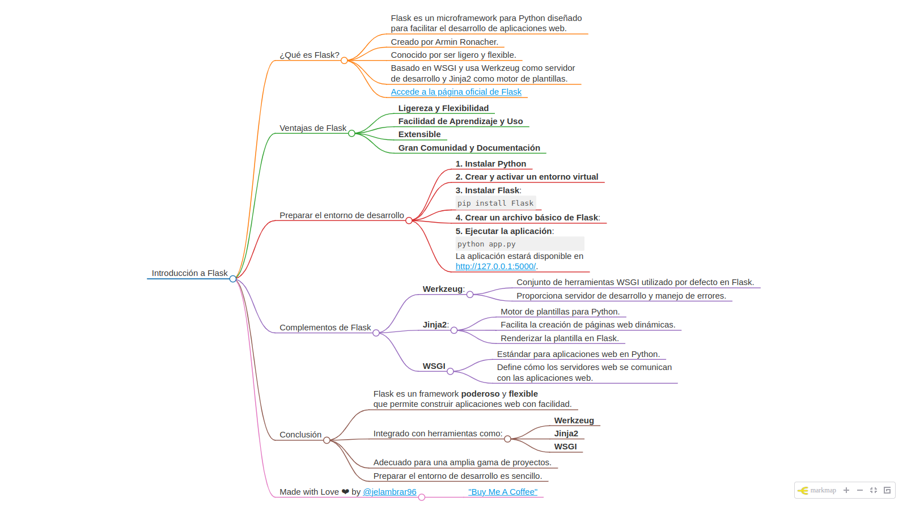

# Introducción a Flask.


Imagen tomada de la documentación oficial, [aqui](https://flask.palletsprojects.com/en/3.0.x/). 

Flask es un microframework para Python diseñado para facilitar el desarrollo de aplicaciones web. Fue creado por Armin Ronacher y es conocido por ser ligero y flexible, permitiendo a los desarrolladores elegir y añadir las extensiones y componentes que necesiten. Flask se basa en WSGI (Web Server Gateway Interface) y usa Werkzeug como servidor de desarrollo y Jinja2 como motor de plantillas.

Para acceder a la página oficial de Flask, has click [aqui](https://flask.palletsprojects.com/en/3.0.x/)

### Ventajas de Flask frente a otros frameworks

1. **Ligereza y Flexibilidad**: Flask es minimalista, no incluye muchas funcionalidades por defecto, permitiendo a los desarrolladores añadir solo las librerías y extensiones que necesitan.
2. **Facilidad de Aprendizaje y Uso**: Su simplicidad y diseño intuitivo lo hacen ideal para principiantes y pequeños proyectos.
3. **Extensible**: Puedes añadir fácilmente extensiones para funcionalidades como autenticación, formularios, y manejo de bases de datos.
4. **Gran Comunidad y Documentación**: Flask tiene una comunidad activa y bien documentada, lo cual es útil para resolver problemas y aprender nuevas prácticas.

### Preparar el entorno de desarrollo para Flask

1. **Instalar Python**: Asegúrate de tener Python instalado. Puedes verificarlo con `python --version` en tu terminal.
2. **Crear y activar un entorno virtual**:
   ```bash
   python -m venv venv
   source venv/bin/activate  # En Windows: venv\Scripts\activate
   ```
3. **Instalar Flask**:
   ```bash
   pip install Flask
   ```
4. **Crear un archivo básico de Flask**:
   Crea un archivo `app.py` con el siguiente contenido:
   ```python
   from flask import Flask

   app = Flask(__name__)

   @app.route('/')
   def home():
       return "Hello, Flask!"

   if __name__ == '__main__':
       app.run(debug=True)
   ```
5. **Ejecutar la aplicación**:
   ```bash
   python app.py
   ```
   La aplicación estará disponible en `http://127.0.0.1:5000/`.

### Complementos de Flask

1. **Werkzeug**: Es un conjunto de herramientas WSGI que Flask utiliza por defecto. Proporciona un servidor de desarrollo, manejo de errores y otras utilidades necesarias para el desarrollo web.
   
2. **Jinja2**: Es un motor de plantillas para Python. Permite a los desarrolladores separar la lógica de la aplicación del diseño HTML, facilitando la creación de páginas web dinámicas. Flask lo utiliza para renderizar plantillas HTML.
   
   Ejemplo de una plantilla Jinja2 (`templates/index.html`):
   ```html
   <!doctype html>
   <html lang="en">
     <head>
       <meta charset="utf-8">
       <title>Home</title>
     </head>
     <body>
       <h1>{{ message }}</h1>
     </body>
   </html>
   ```
   Renderizar la plantilla en Flask:
   ```python
   from flask import render_template

   @app.route('/')
   def home():
       return render_template('index.html', message="Hello, Flask with Jinja2!")
   ```

3. **WSGI**: Flask se basa en WSGI, que es un estándar para aplicaciones web en Python. WSGI define una forma estándar para que los servidores web se comuniquen con las aplicaciones web, lo que hace que Flask sea compatible con cualquier servidor web que soporte WSGI.

### Conclusión

Flask es un framework poderoso y flexible que te permite construir aplicaciones web con facilidad. Su integración con herramientas comos Werkzeug, Jinja2 y la compatibilidad con WSGI lo hace adecuado para una amplia gama de proyectos, desde pequeños hasta aplicaciones más complejas. Preparar el entorno de desarrollo es sencillo, y con Flask puedes empezar a desarrollar rápidamente.

### Mapa mental del capítulo



### Material Complementario

- **Geeksforgeeks: Flask Tutorial** 
  - Flask Tutorial: [Click aquí](https://www.geeksforgeeks.org/flask-tutorial/)
  - Introduction to Web development using Flask: [Click aquí](https://www.geeksforgeeks.org/python-introduction-to-web-development-using-flask) 
  - How install Flask on Windows? How to Install Flask in Windows? [Click aquí](https://www.geeksforgeeks.org/how-to-install-flask-in-windows/) 


- **j2logo.com: Tutorial Flask en español**
  -  Tutorial de Flask en español: Desarrollando una aplicación web en Python [Click aquí](https://j2logo.com/tutorial-flask-espanol/) 

- **miguelgringerg.com: Flask Mega-Tutorial, Part I: Hello World**
  - [Click aqui](https://blog.miguelgrinberg.com/post/the-flask-mega-tutorial-part-i-hello-world)
  
- **riptutorial.com: Learning Flask Chapter 1**
  - [Click aquí](https://riptutorial.com/Download/flask.pdf)

____

Made with Love ❤️ by [@jelambrar96](https://github.com/jelambrar96)

[](https://www.buymeacoffee.com/jelambrar1)
