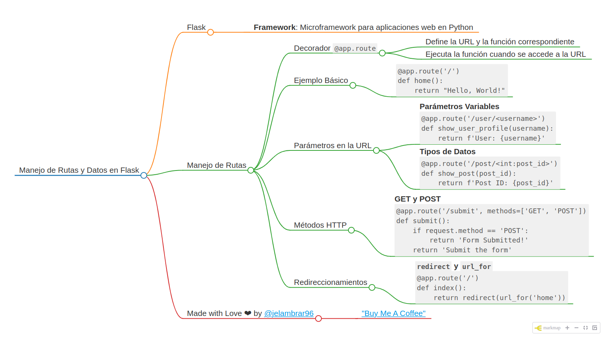
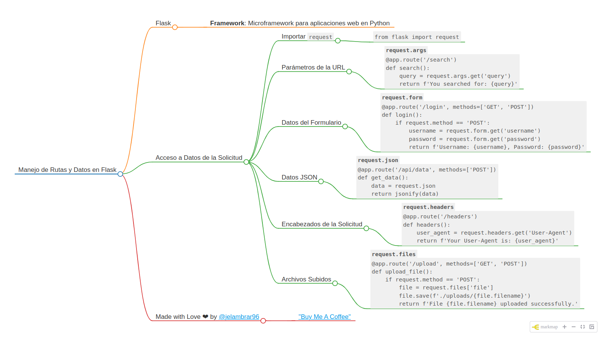

# Manejo de rutas en Flask

### Manejo de Rutas en Flask

Flask utiliza el concepto de rutas para definir qué función debe ejecutarse cuando un usuario visita una URL específica. Esto se logra mediante el uso de decoradores `@app.route`. A continuación, te explicaré cómo funciona el manejo de rutas en Flask y cómo puedes utilizarlo para crear aplicaciones web dinámicas.

El manejo de rutas en Flask es flexible y poderoso, permitiendo crear URLs dinámicas y responder a diferentes métodos HTTP. Con el uso de parámetros y funciones adicionales como `redirect` y `url_for`, puedes construir aplicaciones web complejas y fáciles de mantener.

#### Conceptos Básicos

1. **Decorador `@app.route`**:
   - Este decorador asocia una URL específica con una función en tu aplicación Flask.
   - Cuando un usuario accede a esa URL, la función correspondiente se ejecuta y devuelve una respuesta al cliente (normalmente un navegador web).

#### Ejemplo Básico

```python
from flask import Flask

app = Flask(__name__)

@app.route('/')
def home():
    return "Hello, World!"

if __name__ == '__main__':
    app.run(debug=True)
```

En este ejemplo:
- `@app.route('/')` define la ruta para la URL raíz ('/').
- La función `home` devuelve el texto "Hello, World!" cuando se accede a la URL raíz.

#### Rutas con Parámetros

Puedes definir rutas que acepten parámetros variables. Esto es útil para crear URL dinámicas.

1. **Parámetros en la URL**:
   ```python
   @app.route('/user/<username>')
   def show_user_profile(username):
       return f'User: {username}'
   ```

   En este ejemplo:
   - `@app.route('/user/<username>')` define una ruta que acepta un parámetro `username`.
   - La función `show_user_profile` toma `username` como argumento y devuelve un mensaje que incluye ese nombre.

2. **Parámetros con Tipos de Datos**:
   Puedes especificar el tipo de datos del parámetro en la URL.
   ```python
   @app.route('/post/<int:post_id>')
   def show_post(post_id):
       return f'Post ID: {post_id}'
   ```

   En este caso:
   - `@app.route('/post/<int:post_id>')` define una ruta que acepta un parámetro `post_id` de tipo entero.

#### Métodos HTTP

Por defecto, las rutas en Flask solo responden a solicitudes HTTP GET. Puedes especificar otros métodos HTTP (como POST) usando el parámetro `methods`.

1. **Definir Métodos HTTP**:
   ```python
   @app.route('/submit', methods=['GET', 'POST'])
   def submit():
       if request.method == 'POST':
           return 'Form Submitted!'
       else:
           return 'Submit the form'
   ```

   En este ejemplo:
   - `@app.route('/submit', methods=['GET', 'POST'])` define una ruta que responde tanto a solicitudes GET como POST.
   - Dentro de la función, puedes usar `request.method` para diferenciar entre GET y POST.

#### Redireccionamientos y URL para Funciones

1. **Redireccionamiento**:
   Puedes redirigir a otras rutas utilizando `redirect` y `url_for`.
   ```python
   from flask import redirect, url_for

   @app.route('/')
   def index():
       return redirect(url_for('home'))

   @app.route('/home')
   def home():
       return 'This is the home page'
   ```

   En este ejemplo:
   - `redirect(url_for('home'))` redirige la solicitud a la ruta asociada con la función `home`.

2. **URL para Funciones**:
   `url_for` se utiliza para generar URLs para funciones definidas en tu aplicación.
   ```python
   @app.route('/profile/<username>')
   def profile(username):
       return f'Profile page of {username}'

   @app.route('/')
   def index():
       return redirect(url_for('profile', username='JohnDoe'))
   ```

   Aquí:
   - `url_for('profile', username='JohnDoe')` genera la URL para la función `profile` con el parámetro `username` igual a 'JohnDoe'.

### Ejemplo Completo

A continuación, te muestro un ejemplo completo que incluye varios conceptos de manejo de rutas:

```python
from flask import Flask, redirect, url_for, request

app = Flask(__name__)

@app.route('/')
def index():
    return "Welcome to the Index Page!"

@app.route('/hello/<name>')
def hello(name):
    return f"Hello, {name}!"

@app.route('/post/<int:post_id>')
def show_post(post_id):
    return f"Post ID: {post_id}"

@app.route('/submit', methods=['GET', 'POST'])
def submit():
    if request.method == 'POST':
        return 'Form Submitted!'
    else:
        return 'Submit the form'

@app.route('/redirect-example')
def redirect_example():
    return redirect(url_for('hello', name='Flask'))

if __name__ == '__main__':
    app.run(debug=True)
```

En este ejemplo:
- Definimos varias rutas con y sin parámetros.
- Mostramos cómo manejar diferentes métodos HTTP.
- Incluimos un redireccionamiento utilizando `redirect` y `url_for`.

_____________________________

## Acceso a Datos de la Solicitud (Request) en Flask

En Flask, puedes acceder a los datos enviados en una solicitud HTTP mediante el objeto `request` proporcionado por el módulo `flask`. Este objeto te permite obtener información sobre la solicitud, como los parámetros de la URL, los datos del formulario, los encabezados y más.

#### Importando `request`

Para acceder a los datos de la solicitud, primero necesitas importar `request` desde el módulo `flask`.

```python
from flask import Flask, request
```

### Accediendo a Parámetros de la URL

Los parámetros de la URL (también conocidos como query strings) se pueden acceder mediante `request.args`. Esto devuelve un diccionario de los parámetros enviados en la URL.

```python
@app.route('/search')
def search():
    query = request.args.get('query')
    return f'You searched for: {query}'
```

- Si visitas `http://localhost:5000/search?query=flask`, la salida será: "You searched for: flask".

### Accediendo a Datos del Formulario

Los datos enviados a través de formularios HTML mediante el método POST se pueden acceder mediante `request.form`.

```python
@app.route('/login', methods=['GET', 'POST'])
def login():
    if request.method == 'POST':
        username = request.form.get('username')
        password = request.form.get('password')
        return f'Username: {username}, Password: {password}'
    return '''
        <form method="post">
            Username: <input type="text" name="username"><br>
            Password: <input type="password" name="password"><br>
            <input type="submit" value="Login">
        </form>
    '''
```

- El formulario se muestra cuando visitas `http://localhost:5000/login` y los datos se procesan cuando se envía el formulario.

### Accediendo a Datos JSON

Si una solicitud envía datos en formato JSON, puedes acceder a ellos mediante `request.json`.

```python
@app.route('/api/data', methods=['POST'])
def get_data():
    data = request.json
    return f'JSON received: {data}'
```

- Puedes enviar datos JSON a esta ruta utilizando herramientas como `curl` o `Postman`.

### Accediendo a Encabezados de la Solicitud

Los encabezados de la solicitud se pueden acceder mediante `request.headers`.

```python
@app.route('/headers')
def headers():
    user_agent = request.headers.get('User-Agent')
    return f'Your User-Agent is: {user_agent}'
```

- Cuando visitas `http://localhost:5000/headers`, obtendrás el User-Agent del navegador.

### Accediendo a Archivos Subidos

Puedes manejar archivos subidos mediante formularios HTML utilizando `request.files`.

```python
@app.route('/upload', methods=['GET', 'POST'])
def upload_file():
    if request.method == 'POST':
        file = request.files['file']
        file.save(f'./uploads/{file.filename}')
        return f'File {file.filename} uploaded successfully.'
    return '''
        <form method="post" enctype="multipart/form-data">
            <input type="file" name="file"><br>
            <input type="submit" value="Upload">
        </form>
    '''
```

- El formulario permite subir archivos y guardarlos en un directorio `uploads`.

### Ejemplo Completo

A continuación, un ejemplo completo que muestra cómo acceder a varios tipos de datos en una solicitud:

```python
from flask import Flask, request, jsonify

app = Flask(__name__)

@app.route('/')
def home():
    return 'Welcome to the Flask app!'

@app.route('/search')
def search():
    query = request.args.get('query')
    return f'You searched for: {query}'

@app.route('/login', methods=['GET', 'POST'])
def login():
    if request.method == 'POST':
        username = request.form.get('username')
        password = request.form.get('password')
        return f'Username: {username}, Password: {password}'
    return '''
        <form method="post">
            Username: <input type="text" name="username"><br>
            Password: <input type="password" name="password"><br>
            <input type="submit" value="Login">
        </form>
    '''

@app.route('/api/data', methods=['POST'])
def get_data():
    data = request.json
    return jsonify(data)

@app.route('/headers')
def headers():
    user_agent = request.headers.get('User-Agent')
    return f'Your User-Agent is: {user_agent}'

@app.route('/upload', methods=['GET', 'POST'])
def upload_file():
    if request.method == 'POST':
        file = request.files['file']
        file.save(f'./uploads/{file.filename}')
        return f'File {file.filename} uploaded successfully.'
    return '''
        <form method="post" enctype="multipart/form-data">
            <input type="file" name="file"><br>
            <input type="submit" value="Upload">
        </form>
    '''

if __name__ == '__main__':
    app.run(debug=True)
```

### Resumen

- **`request.args`**: Accede a los parámetros de la URL.
- **`request.form`**: Accede a los datos del formulario.
- **`request.json`**: Accede a los datos JSON enviados en una solicitud.
- **`request.headers`**: Accede a los encabezados de la solicitud.
- **`request.files`**: Maneja archivos subidos.

Estos métodos permiten que tu aplicación Flask maneje una amplia variedad de datos enviados por los clientes, haciendo tu aplicación más interactiva y funcional.

### Unos pequeños mapas mentales para resumir el capítulo

#### Manejo de Rutas en Flask



#### Acceso a Datos de solicitudes en Flask



______

### Material Recomendado

- **Geeksforgeeks: Flask Tutorial** 
  - Flask Tutorial: [Click aquí](https://www.geeksforgeeks.org/flask-tutorial/)
  - Flask - Variable Rule: [Click aquí](https://www.geeksforgeeks.org/flask-variable-rule)
  - Redirecting to URL in Flask: [Click aquí](https://www.geeksforgeeks.org/redirecting-to-url-in-flask)
  - Flask - HTTP Method: [Click aquí](https://www.geeksforgeeks.org/flask-http-method)

  
- **riptutorial.com: Learning Flask Chapter 14, 15, 16**
  - [Click aquí](https://riptutorial.com/Download/flask.pdf)

______

Made with Love ❤️ by [@jelambrar96](https://github.com/jelambrar96)

[](https://www.buymeacoffee.com/jelambrar1)

